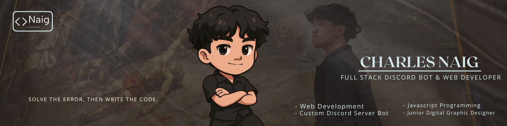

<h1 align="center"> Hi, I'm Charles Marcelo (hatry4/Naig)</h1>
<h3 align="center"> Full-Stack Discord Bot & Web Developer |  Gamer |  FEU Student from the Philippines</h3>

  

 

##  About Me

Hey there! I'm Charles, a passionate **17-year-old developer** from the Philippines who loves creating digital experiences. Born on December 29, 2007, I've been on an exciting journey learning web development and design.

-  Currently mastering **Full-Stack Development** (Front-End & Back-End)
-  **Accepting freelance projects** starting at **<a href=""> $15-35 / ₱900-1,100 </a>**
-  Goal: Building innovative web solutions that make a difference
-  When I'm not coding, you'll find me gaming or exploring new technologies
-  Reach out: **cm122927@gmail.com**

  

##  My Coding Inspiration

  
  
   
  <i>My Fiance/girlfriend - the inspiration behind my coding journey </i>

##  Tech Stack

###  Languages

###  Frameworks & Tools

###  Cloud & Hosting

###  Database & Design

##  GitHub Analytics

  
  

  

##  Let's Connect!

##  Support My Work

If you like what I do and want to support my journey, consider buying me a coffee! 

---

  <i> "Code is like humor. When you have to explain it, it's bad." - Cory House</i>

   If you find my work interesting, don't forget to star my repositories!

<!-- Crafted with ❤️ by hatry4 -->
